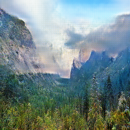
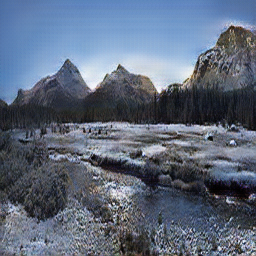
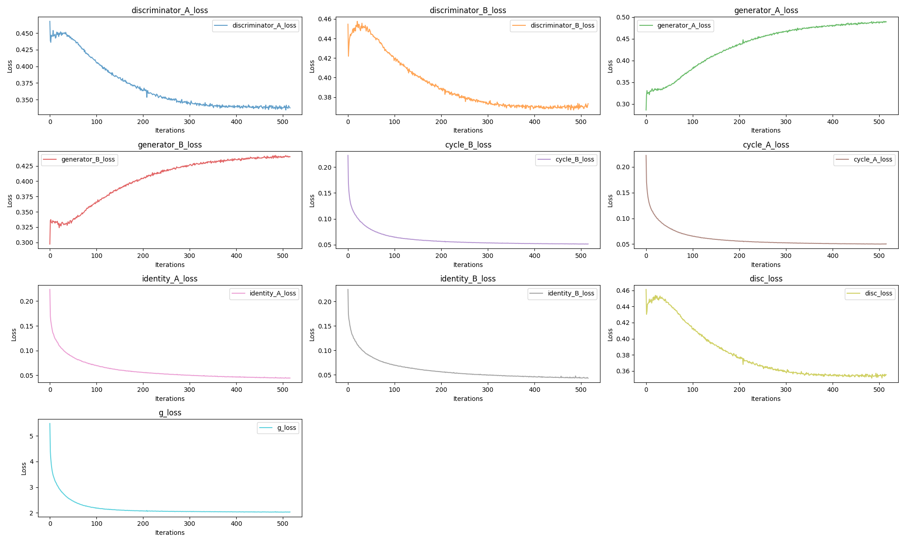
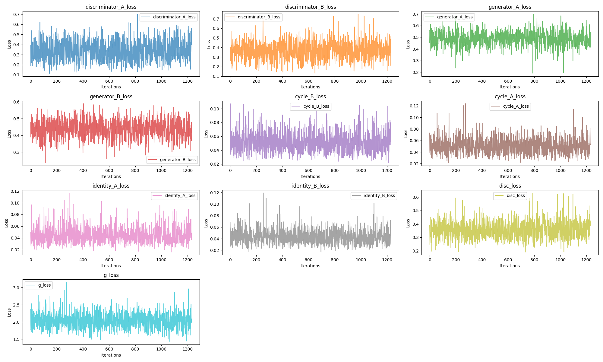

# CycleGAN应用于冬季和夏季图片风格的转化
README语言设置:
<p align="left">
    <a href="README.md">中文</a>&nbsp ｜ &nbsp<a href="README_EN.md">English</a>
</p>

这是一个实现将图片从`冬季转换为夏季`以及相反方向转换的`CycleGAN项目`。本项目包含了`模型定义，训练，轻量级应用搭建的程序脚本`，并指明了`计算集和模型文件地址`，同时，本项目记录了整个`训练过程的不同部分的损失情况`，以及基于`gradio的轻量级应用`的演示图片，可在本文下方找到，另外，`模型的网络结构以及损失函数的剖析`放在本介绍的末尾，以供参考和提出改善建议。

## 项目结构

- **data-save{true, fake}**: 存放训练过程中生成的fake和true图片的文件夹，应当手动创建
- **train{summer,winter}**: 包含用于训练的冬季和夏季图片的子文件夹，应当下载数据集在此目录[Summer2Winter Yosemite](https://www.kaggle.com/datasets/balraj98/summer2winter-yosemite)
- **model{loss}**: 包括训练期间损失函数的图像, 以及相应的模型文件
- **app.py**: 用于加载训练好的模型并创建一个Gradio应用程序以生成季节性图片的网页端程序。
- **config.py**: 包含模型训练参数和加载路径的文件。
- **data_loading.py**: 用于加载数据集并创建图片对用于训练的模块。
- **loss_dict_avg.json**: 记录各部分损失函数的JSON文件。
- **model.py**: 定义生成器和判别器模型的代码文件。
- **train.py**: 用于训练模型的代码脚本。
- **utils.py**: 包含保存/加载模型和绘制损失的函数的代码。

## 概览

该项目使用PyTorch实现了CycleGAN，用于将图片从冬季转换为夏季，反之亦然。
使用的损失函数是L1和MSE，其中L1用于生成器，MSE用于判别器。
我们将`LAMBDA_CYCLE`设置为10，并将`LAMBDA_IDENTITY`设置为1.0，而不是原论文的0.0，以提高图像的逼真度。
其中各部分损失记录在`loss_dict_avg.json`中。

模型文件地址：[hugging face](https://huggingface.co/masquerlin/cycleGAN_winter_summer/tree/main)

训练所使用的数据集来源于[Summer2Winter Yosemite](https://www.kaggle.com/datasets/balraj98/summer2winter-yosemite)。模型训练了约500个epochs，在接近200个epochs时观察到了较好的拟合。

## 结果

以下是训练模型的一些结果：

### 冬季到夏季

       

*描述: 冬季图片转换为夏季的示例。*

       

*描述: 另一张冬季图片转换为夏季的示例。*

### 夏季到冬季
       

*描述: 夏季图片转换为冬季的示例。*

       

*描述: 另一张夏季图片转换为冬季的示例。*

## 损失函数演变

以下图表展示了训练过程中损失函数的演变：
第一张图片为损失随着epochs的变化的图表



*描述: 显示生成器和判别器损失随着epochs的变化的图表。*

第二张图片为最后一轮迭代，各个部分的loss的详细图表，以一个batch_size为x轴的维度。



## 使用方法

1. 克隆该存储库：

   ```bash
   git clone https://github.com/masquerlin/CycleGAN.git
   cd your_repository
2. 安装相应环境：
    ```bash
   pip install -r requirements.txt
3. 设置config参数

4. 训练模型
    ```bash
    python train.py

5. 加载模型进行生成图片，打开本地服务：
    ```bash
     python app.py

## gradio框架的轻量级应用:


## Generator 模型结构

### Initial Block:

- Conv2d:
  - 输入特征数：`img_channels`
  - 输出特征数：`num_features`
- ReLU 激活

### First Down Block:

- Conv2d:
  - 输入特征数：`num_features`
  - 输出特征数：`num_features * 2`

- InstanceNorm2d
- ReLU 激活函数

### Second Down Block:

- Conv2d:
  - 输入特征数：`num_features * 2`
  - 输出特征数：`num_features * 4`

- InstanceNorm2d
- ReLU 激活函数

### Residual Blocks (数量为 `num_residuals`，这里假设为 9):

每个 ResidualBlock 内部包含以下层数：

- Conv2d:
  - 输入特征数：`num_features * 4`
  - 输出特征数：`num_features * 4`
- InstanceNorm2d
- ReLU 激活函数

### First Up Block:

- ConvTranspose2d (上采样):
  - 输入特征数：`num_features * 4`
  - 输出特征数：`num_features * 2`

- InstanceNorm2d
- ReLU 激活函数

### Second Up Block:

- ConvTranspose2d (上采样):
  - 输入特征数：`num_features * 2`
  - 输出特征数：`num_features`

- InstanceNorm2d
- ReLU 激活函数

### Last Block:

- Conv2d:
  - 输入特征数：`num_features`
  - 输出图像通道数：`img_channels`

- Tanh 激活函数

---

## Discriminator 模型结构
卷积参数如下：features=[64, 128, 256, 512]
### Initial Block:

- Conv2d:
  - 输入特征数：`in_channels`
  - 输出特征数：`features[0]`

- LeakyReLU 激活函数：负数斜率为 0.2

### Block:
- Conv2d:
  - 输入特征数：`features[0]`
  - 输出特征数：`features[1]`

- InstanceNorm2d
- LeakyReLU 激活函数：负数斜率为 0.2

### Block:
- Conv2d:
  - 输入特征数：`features[1]`
  - 输出特征数：`features[2]`

- InstanceNorm2d
- LeakyReLU 激活函数：负数斜率为 0.2

### Block:
- 输入特征数：`features[2]`
- 输出特征数：`features[3]`
- Stride: 1

该 Block 类包含以下神经网络层：

- Conv2d:
  - 输入特征数：`features[2]`
  - 输出特征数：`features[3]`
- InstanceNorm2d
- LeakyReLU 激活函数：负数斜率为 0.2

### 最后一层 Conv2d:
- 输入特征数：`features[3]`
- 输出特征数：1
- Sigmoid 激活函数：用于输出，将输出范围压缩到 [0, 1]


## 损失函数定义

### 判别器（Discriminator）损失函数：

#### 对抗损失（Adversarial Loss）：
- 使用 Mean Squared Error (MSE) 损失函数：
- 最终判别器损失：
 - `disc_loss = (disc_B_loss + disc_A_loss) / 2`

### 生成器（Generator）损失函数：

#### 对抗损失（Adversarial Loss）：
- 使用 Mean Squared Error (MSE) 损失函数：
  - 计算生成器 A 的损失：`gen_A_loss`
  - 计算生成器 B 的损失：`gen_B_loss`

#### 循环一致性损失（Cycle Consistency Loss）：
- 使用 L1 损失函数：
  - 计算重建图片 B 的损失：
    - `cycle_B_loss = L1(B_image, cycle_B)`
  - 计算重建图片 A 的损失：
    - `cycle_A_loss = L1(A_image, cycle_A)`

#### 同一性损失（Identity Loss）：
- 使用 L1 损失函数：
  - 计算生成器 B 的同一性损失：
    - `identity_B_loss = L1(B_image, identity_B)`
  - 计算生成器 A 的同一性损失：
    - `identity_A_loss = L1(A_image, identity_A)`

#### 生成器总损失（Generator Total Loss）：
- 综合以上损失项计算：
  - `g_loss = (gen_A_loss + gen_B_loss + cycle_B_loss * config.LAMBDA_CYCLE + cycle_A_loss * config.LAMBDA_CYCLE + identity_B_loss * config.LAMBDA_IDENTITY + identity_A_loss * config.LAMBDA_IDENTITY)`
#### 最终使用Adam优化器优化：
- 使用`Adam`：
