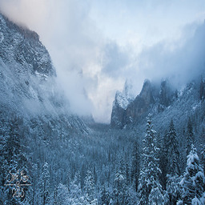
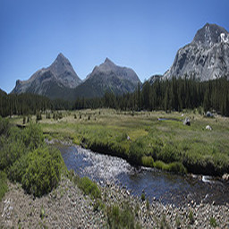

# 冬季到夏季 CycleGAN

这是一个实现将图片从冬季转换为夏季以及相反方向转换的CycleGAN项目。神经网络模型是自定义的，该存储库包含了损失函数、训练图片以及运行和测试模型的脚本。

## 项目结构

- **data-save**: 存放训练过程中生成的fake和true图片的文件夹。
- **train**: 包含用于训练的冬季和夏季图片的子文件夹。
- **model**: 包括训练期间损失函数的图像。
- **app.py**: 用于加载训练好的模型并创建一个Gradio应用程序以生成季节性图片的脚本。
- **config.py**: 包含模型训练参数和加载路径的文件。
- **data_loading.py**: 用于加载数据集并创建图片对用于训练的模块。
- **loss_dict_avg.json**: 记录生成器和判别器损失值的JSON文件。
- **model.py**: 定义生成器和判别器模型的代码文件。
- **train.py**: 用于训练模型的脚本。
- **utils.py**: 包含保存/加载模型和绘制损失的函数的文件。

## 概览

该项目使用PyTorch实现了CycleGAN，用于将图片从冬季转换为夏季，反之亦然。
使用的损失函数是L1和MSE，其中L1用于生成器，MSE用于判别器。
我们将`LAMBDA_CYCLE`设置为10，并将`LAMBDA_IDENTITY`设置为1.0，而不是原论文的0.0，以提高图像的逼真度。
其中各部分损失记录在`loss_dict_avg.json`中。

训练所使用的数据集来源于[Summer2Winter Yosemite](https://www.kaggle.com/datasets/balraj98/summer2winter-yosemite)。模型训练了约500个epochs，在接近200个epochs时观察到了较好的拟合。

## 结果

以下是训练模型的一些结果：

### 冬季到夏季

(./pngs/winter_to_summer_1.png)
*描述: 冬季图片转换为夏季的示例。*
(./pngs/winter_to_summer_2.png)
*描述: 另一张冬季图片转换为夏季的示例。*

### 夏季到冬季
(./pngs/summer_to_winter_1.png)
*描述: 夏季图片转换为冬季的示例。*
(./pngs/summer_to_winter_2.png)
*描述: 另一张夏季图片转换为冬季的示例。*

## 损失函数演变

以下图表展示了训练过程中损失函数的演变：


*描述: 显示生成器和判别器损失随着epochs的变化的图表。*


## 使用方法

1. 克隆该存储库：

   ```bash
   git clone https://github.com/your_username/your_repository.git
   cd your_repository
