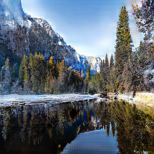
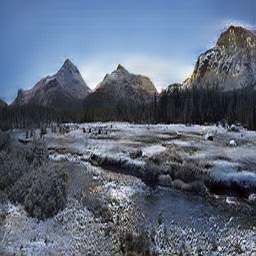
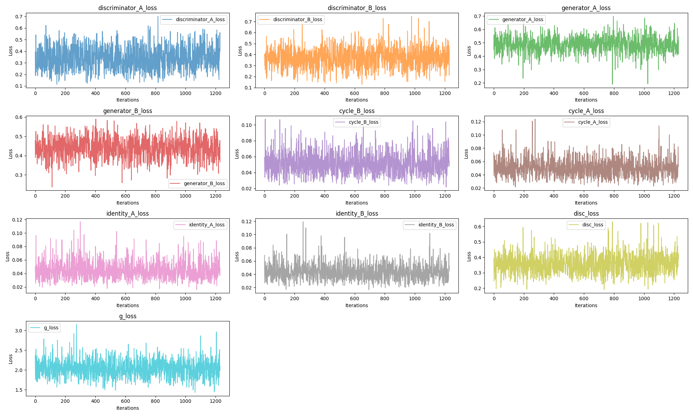

# CycleGAN for Winter and Summer Image Style Transfer

This is a CycleGAN project implemented to transform images from `winter to summer` and vice versa. The project includes `model definitions, training scripts, lightweight application setup` for converting between the seasons. It also specifies the `location of computed sets and model files`. Additionally, this project documents the `losses of different parts during training`, and provides `demo images for a lightweight application based on gradio`, which can be found below. Furthermore, an `analysis of the model's network structure and loss functions` is provided at the end of this introduction for reference and improvement suggestions.

## Project Structure

- **data-save{true, fake}**: Directory for storing generated fake and true images during training (needs to be created manually)
- **train{summer, winter}**: Contains subdirectories with winter and summer images for training. The dataset can be downloaded from [Summer2Winter Yosemite](https://www.kaggle.com/datasets/balraj98/summer2winter-yosemite)
- **model{loss}**: Includes images of the loss functions during training, along with corresponding model files
- **app.py**: Script for loading the trained model and creating a Gradio application to generate seasonal images in a web interface
- **config.py**: File containing model training parameters and load paths
- **data_loading.py**: Module for loading the dataset and creating pairs of images for training
- **loss_dict_avg.json**: JSON file recording the average loss of each part during training
- **model.py**: Code file defining the generator and discriminator models
- **train.py**: Script for training the model
- **utils.py**: Code containing functions for saving/loading models and plotting losses

## Overview

This project uses PyTorch to implement CycleGAN for transforming images from winter to summer and vice versa.
The loss functions used are L1 and MSE, with L1 used for the generator and MSE for the discriminator.
We have set `LAMBDA_CYCLE` to 10 and `LAMBDA_IDENTITY` to 1.0 instead of 0.0 as in the original paper to improve image realism.
The losses for each part are recorded in `loss_dict_avg.json`.

Model files: [hugging face](https://huggingface.co/masquerlin/cycleGAN_winter_summer/tree/main)

The dataset used for training is from [Summer2Winter Yosemite](https://www.kaggle.com/datasets/balraj98/summer2winter-yosemite). The model was trained for approximately 500 epochs, with good fitting observed around 200 epochs.

## Results

Here are some results from the trained model:

### Winter to Summer

       

*Description: Example of transforming a winter image to summer.*

       

*Description: Another example of transforming a winter image to summer.*

### Summer to Winter
       

*Description: Example of transforming a summer image to winter.*

       

*Description: Another example of transforming a summer image to winter.*

## Evolution of Loss Functions

The following charts illustrate the evolution of the loss functions during training:

The first image shows the plot of generator and discriminator losses over epochs


*Description: Plot showing the generator and discriminator losses over epochs.*

The second image shows a detailed plot of the losses of different parts in the last epoch, with batch size as the x-axis dimension.



## 使用方法

1. Clone the repository:

   ```bash
   git clone https://github.com/masquerlin/CycleGAN.git
   cd your_repository
2. Install required packages
    ```bash
   pip install -r requirements.txt
3. Set config parameters

4. Train the model
    ```bash
    python train.py

5. Load the trained model for image generation and start the local server：
    ```bash
     python app.py

## Lightweight Application with gradio Framework:


## Generator Model Architecture

### Initial Block:

- Conv2d:
  - Input Channels：`img_channels`
  - Output Channels:`num_features`
- ReLU activation

### First Down Block:

- Conv2d:
  - Input Channels:`num_features`
  - Output Channels:`num_features * 2`

- InstanceNorm2d
- ReLU activation

### Second Down Block:

- Conv2d:
  - Input Channels:`num_features * 2`
  - Output Channels:`num_features * 4`

- InstanceNorm2d
- ReLU activation

### Residual Blocks (number of num_residuals, assumed to be 9):

Each ResidualBlock contains the following layers:

- Conv2d:
  - Input Channels:`num_features * 4`
  - Output Channels:`num_features * 4`
- InstanceNorm2d
- ReLU activation

### First Up Block:

- ConvTranspose2d (Upsampling):
  - Input Channels:`num_features * 4`
  - Output Channels:`num_features * 2`

- InstanceNorm2d
- ReLU activation

### Second Up Block:

- ConvTranspose2d (Upsampling):
  - Input Channels:`num_features * 2`
  - Output Channels:`num_features`

- InstanceNorm2d
- ReLU activation

### Last Block:

- Conv2d:
  - Input Channels:`num_features`
  - Output Channels:`img_channels`

- Tanh activation

---

## Discriminator Model Architecture
Convolution parameters: features=[64, 128, 256, 512]
### Initial Block:

- Conv2d:
  - Input Channels:`in_channels`
  - Output Channels:`features[0]`

- LeakyReLU activation with a negative slope of 0.2

### Block:
- Conv2d:
  - Input Channels:`features[0]`
  - Output Channels:`features[1]`

- InstanceNorm2d
- LeakyReLU activation with a negative slope of 0.2

### Block:
- Conv2d:
  - Input Channels:`features[1]`
  - Output Channels:`features[2]`

- InstanceNorm2d
- LeakyReLU activation with a negative slope of 0.2

### Block:
- Input Channels:`features[2]`
- Output Channels:`features[3]`

This Block class contains the following neural network layers:

- Conv2d:
  - Input Channels:`features[2]`
  - Output Channels:`features[3]`
- InstanceNorm2d
- LeakyReLU activation with a negative slope of 0.2

### Last Conv2d Layer:
- Input Channels:`features[3]`
- Output Channels:1
- Sigmoid activation for output, compressing output to [0, 1]


## Loss Function Definitions

### Discriminator Loss Functions:

#### Adversarial Loss:
- Using Mean Squared Error (MSE) loss function
- Final discriminator loss:
 - `disc_loss = (disc_B_loss + disc_A_loss) / 2`

### Generator Loss Functions:

#### Adversarial Loss:
- Using Mean Squared Error (MSE) loss function
  - Calculate generator A loss:`gen_A_loss`
  - Calculate generator B loss: `gen_B_loss`

#### Cycle Consistency Loss:
- Using L1 loss function
  - Calculate loss for reconstructing image B:
    - `cycle_B_loss = L1(B_image, cycle_B)`
  - Calculate loss for reconstructing image A:
    - `cycle_A_loss = L1(A_image, cycle_A)`

#### Identity Loss:
- Using L1 loss function
  - Calculate identity loss for generator B:
    - `identity_B_loss = L1(B_image, identity_B)`
  - Calculate identity loss for generator A:
    - `identity_A_loss = L1(A_image, identity_A)`

#### Total Generator Loss:
- Combining the above loss terms:
  - `g_loss = (gen_A_loss + gen_B_loss + cycle_B_loss * config.LAMBDA_CYCLE + cycle_A_loss * config.LAMBDA_CYCLE + identity_B_loss * config.LAMBDA_IDENTITY + identity_A_loss * config.LAMBDA_IDENTITY)`
#### Optimized with Adam:
- Using Adam optimizer

